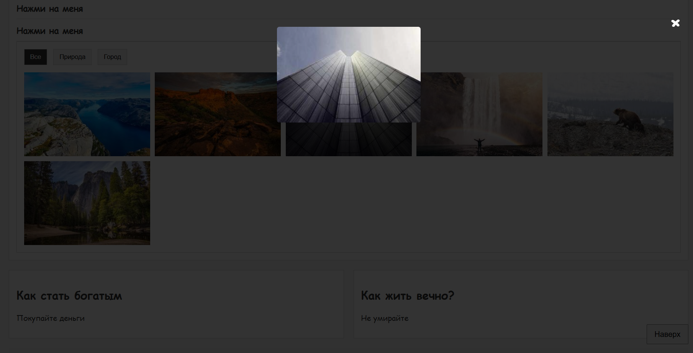
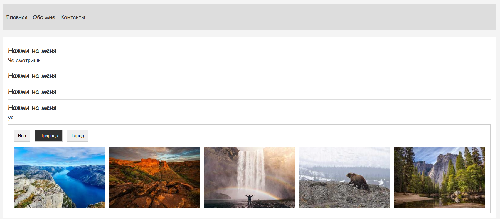

Лабораторная работа №5

Ответы на вопросы:

Какие интерактивности добавлены на страницу?
На странице реализованы следующие интерактивные элементы: кнопка «Наверх» с плавной прокруткой, аккордеон, фильтрация изображений в галерее, модальное окно с увеличением изображения при клике.

Где использовался ИИ, а где код писался вручную?
С помощью ИИ была сгенерирована часть JavaScript-кода для интерактивных элементов. Правки, адаптация под структуру страницы и верстка выполнялись вручную.

Что показалось самым интересным или сложным?
Интереснее всего было реализовывать модалку с увеличением изображения. Сложным показалось настроить корректное закрытие модального окна и плавность интерфейса.

Какие запросы делали LLM?
Запросы касались создания кнопки прокрутки вверх, аккордеона, фильтрации галереи, модального окна и объяснения работы JavaScript-кода.